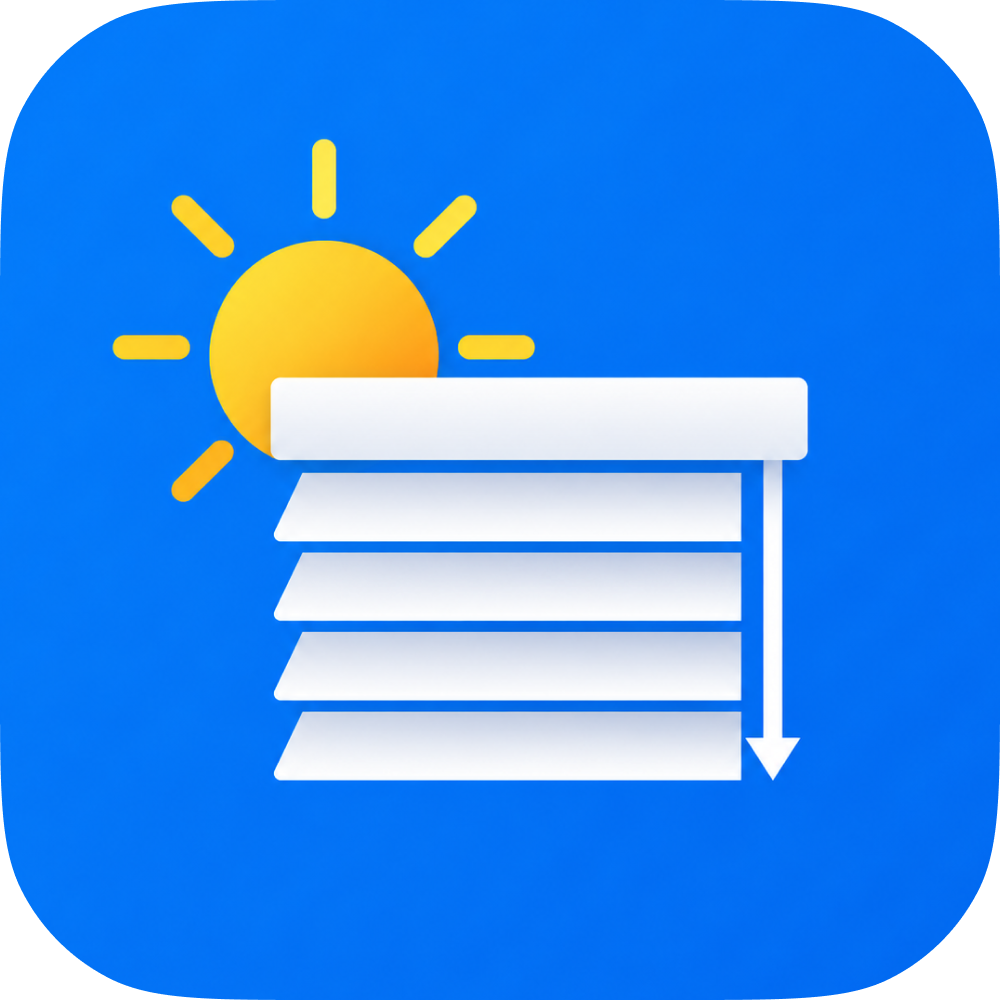

# Solar Cover

A [Home Assistant](https://www.home-assistant.io/) integration that automatically moves your blinds, shutters, and awnings based on where the sun actually is — and steps back when it isn't needed.

---

## What it does

Solar Cover watches the sun's position throughout the day and moves your covers to block direct sunlight when it hits your windows. When the sun moves away, or drops low enough that glare is no longer a problem, covers return to your preferred resting position.

It works for three cover types:

- **Roller blinds and shutters** — lowers the cover to keep a specific depth of your room free from direct sun
- **Awnings** — extends the awning to shade a specific distance out onto your terrace or patio
- **Venetian blinds** — tilts the slats to block the sun's angle precisely without closing the view

The key difference from other automations: Solar Cover knows *why* it is making each decision, and tells you. If your covers are open when you expect them closed, there is always a clear reason visible in Home Assistant.

---

## Installation

### Via HACS (recommended)

1. Open HACS in your Home Assistant sidebar
2. Go to **Integrations** and click the three-dot menu → **Custom repositories**
3. Add `https://github.com/carloscae/solar-cover` as an **Integration**
4. Search for **Solar Cover** and install it
5. Restart Home Assistant
6. Go to **Settings → Devices & Services → Add Integration** and search for **Solar Cover**

### Manual

1. Copy the `custom_components/solar_cover/` folder into your HA `custom_components/` directory
2. Restart Home Assistant
3. Go to **Settings → Devices & Services → Add Integration** and search for **Solar Cover**

---

## Setup

Setup has two parts: **Global Settings** (once, for the whole integration) and **Cover Zones** (one per group of covers that move together).

### Part 1 — Global Settings

These settings apply to all your cover zones. Everything here is optional — you can skip any field you do not need.

| Setting | What it does |
|---|---|
| **Weather entity** | Connects a weather service so covers retract automatically in rain or strong wind |
| **Retract in strong wind** | Wind speed above this value retracts all covers (in m/s). Leave empty to ignore wind. |
| **Minimum outdoor temperature** | Covers stay open below this temperature so the room can warm up in winter (°C) |
| **Rest position** | Where covers sit when the sun is not hitting the window (0 = fully open, 100 = fully closed). Default is fully open. |
| **Manual override duration** | After you move a cover by hand, automation pauses for this many minutes before resuming |
| **Cloud coverage sensor** | A sensor reporting 0–100% cloud coverage. Covers stay open above the threshold you set. |
| **Cloud coverage threshold** | The percentage above which covers stay open (e.g. 85%) |
| **Solar radiation sensor** | A sensor reporting sunlight intensity in W/m². More accurate than cloud coverage. Covers stay open when radiation is below your threshold. |
| **Solar radiation threshold** | Intensity below which covers stay open (e.g. 120 W/m²). On a clear summer day you might see 800–1000 W/m². |

> **Radiation vs cloud coverage:** If you configure both, radiation takes priority. On a partly cloudy day, radiation tells you whether the sun is actually breaking through — cloud percentage alone cannot do that.

---

### Part 2 — Cover Zones

A zone is a group of covers that move together — for example, all the blinds on your south-facing living room windows. Add one zone per group.

#### Step 1 — Name, devices, and cover type

| Setting | What it does |
|---|---|
| **Zone name** | A label for this zone, e.g. "Living room south" |
| **Cover devices** | The cover entities in Home Assistant that this zone controls. You can add multiple. Leave empty to observe without controlling anything. |
| **Cover type** | Roller blind / shutter, awning, or venetian blind |

#### Step 2 — Window direction and geometry

**Finding your window's compass direction**

Stand inside your room and face the window directly. Open the compass app on your phone, hold it flat (screen facing up), and note the direction you are facing. That number is your window's compass bearing.

- North-facing window: 0 (or 360)
- East-facing window: 90
- South-facing window: 180
- West-facing window: 270

> Tip: Hold your phone flat and parallel to the glass for the most accurate reading. The compass shows the direction you are facing, which is the direction your window faces outward.

**Common settings (all cover types)**

| Setting | What it does |
|---|---|
| **Window compass bearing** | The direction your window faces (see above) |
| **Sun enters window** | How many degrees to the left of your window the sun starts shining in. Begin with 90° and reduce if a wall or obstacle blocks part of the view. |
| **Sun leaves window** | Same, but for the right side |
| **Minimum sun height** | The sun must be at least this many degrees above the horizon before covers deploy. Pre-filled automatically from your location. Lower values mean earlier morning and later afternoon coverage. |
| **Minimum shading position** | The cover will never go below this position while shading. Set to 30% to always keep some daylight in. |
| **Maximum shading position** | The cover will never go above this position. Set to 80% if you always want some view through the window. |

**Roller blinds and shutters**

| Setting | What it does |
|---|---|
| **Window height** | Height of the glass area from floor to top (metres) |
| **Shade depth** | How far into the room to keep free from direct sun (metres). A desk 1.5 m from the window needs at least 1.5 m here. |

**Awnings**

| Setting | What it does |
|---|---|
| **Awning rail height** | How high above the floor the awning is mounted (metres) |
| **Maximum reach** | How far out the awning extends when fully open, measured horizontally (metres) |
| **Awning angle** | The downward tilt of the awning from horizontal (degrees). Typical values: 10–20°. |
| **Target shade distance** | How far out onto the terrace the shadow should reach (metres). If your outdoor table sits 3 m from the wall, set this to 3 m. |

**Venetian blinds**

| Setting | What it does |
|---|---|
| **Slat width** | Width of each individual slat (millimetres) |
| **Slat spacing** | Distance from the centre of one slat to the centre of the next (millimetres). Must not exceed slat width. |
| **Tilt range** | Single: slats go from fully open to fully closed. Bidirectional: slats can also tilt past horizontal in both directions. |

---

## What gets created in Home Assistant

Each zone creates a device with the following entities:

### Switch - Automation active

Turns automation on or off for this zone. When off, covers stay wherever they are and Solar Cover stops sending commands. The switch state survives restarts.

### Button - Reset timers

Clears both internal timers at once - the stability hold and any manual override - so the current solar decision takes effect immediately, without waiting out a delay or a hold. Handy while you are tuning settings.

### Sensors (diagnostic)

These are visible in the device page and useful for understanding what the system is doing.

| Sensor | What it shows |
|---|---|
| **Active intent** | The current decision and reason (see below) |
| **Sun elevation** | How high the sun is above the horizon right now (degrees) |
| **Sun azimuth** | The sun's compass direction right now (degrees) |
| **Sun angle to window** | How directly the sun is facing your window. 0° means the sun is straight on; 90° means it is coming from the side. |
| **Calculated position** | The position the geometry says the cover should be at (%) |
| **Sun enters window** | The time today when the sun first starts shining into this window |
| **Sun leaves window** | The time today when the sun stops shining into this window |
| **Pending change commits** | When a delayed intent change will take effect (only while a stability delay is counting down). Shows what is waiting in its `pending_intent` attribute. |
| **Manual hold expires** | When an active manual override will end and automation resumes |

### Cover entity

The cover entity reflects the last position Solar Cover commanded. You can also use it in your own automations or dashboards.

Besides `intent`, it exposes two attributes that explain the current decision in detail:

- **`reason`** - a plain-language sentence, e.g. `Retracted (weather): raining; wind 45 km/h exceeds 40 km/h limit`. Put it on a dashboard card to always see why the cover is where it is.
- **`reason_detail`** - a structured list of the exact conditions that fired, each with the measured value, your threshold, the unit, and the margin (how far over or under). Ideal for templates and automations. When more than one condition applies (for example rain *and* high wind), every one is listed - so you know all the settings worth adjusting, not just the first.

---

## Active intent — understanding why covers are where they are

The **Active intent** sensor always shows you exactly what Solar Cover is doing and why:

| State | Meaning |
|---|---|
| **Shading** | Sun is hitting the window — covers are actively positioned to block it |
| **Sun too low** | The sun is below the minimum height threshold. No glare risk. Covers are at rest position. |
| **Sun outside window** | The sun is not in front of this window right now. Covers are at rest position. |
| **Retracted - weather** | Covers are held open due to rain, wind, or cold temperature |
| **Retracted - overcast** | Cloud coverage or low radiation means there is no meaningful sunlight to block |
| **Manual override** | You moved a cover by hand recently. Automation is paused until the override timer runs out. |

The intent state tells you the *category*; the cover's **`reason`** and **`reason_detail`** attributes (above) tell you the *specifics* - which exact condition fired and by how much. So "Retracted - weather" becomes "wind 45 km/h exceeds 40 km/h limit", and you can see at a glance whether to raise your wind threshold or leave it.

---

## How it decides when to shade

Solar Cover checks a series of conditions in order. The first one that triggers stops the process:

1. **Is the sun high enough?** Below the minimum angle, no shading needed.
2. **Is the sun facing this window?** If the sun is behind the house or blocked by an obstacle, no shading needed.
3. **Is the weather ok?** Rain, strong wind, or cold temperature keeps covers open.
4. **Is there actual sunlight?** If a cloud or radiation sensor reports low light, no shading needed even if the sun is geometrically in the right position.
5. **Did you move it manually?** If so, automation is paused.
6. **Shade.** The geometry formula calculates the exact position for your cover type.

---

## Tips

**Start with default values.** The elevation threshold is pre-calculated from your location. The FOV left/right values of 90° each cover a full hemisphere — only reduce them if a wall or overhang visibly cuts off part of your sky view.

**Use the shade depth to protect a specific spot.** For blinds, set shade depth to the distance from your window to where you want shade to stop — a sofa, a desk, or a TV. For awnings, set it to where your outdoor furniture is.

**Set a minimum position if you always want some daylight.** A minimum of 20–30% keeps the room bright while still blocking the worst of the glare.

**The radiation threshold is your best overcast filter.** If you have a local weather station with a radiation sensor, set the threshold to around 120 W/m². Below that, the sun is not strong enough to cause meaningful glare even if it is technically above the horizon.

**Manual override is intentional.** When you move a cover by hand, Solar Cover steps back for the duration you configured. After that, it resumes. You do not need to remember to turn automation back on.

**Tune with the reason in view.** When a cover is not where you expect, read the cover's `reason` attribute - it names the exact condition and the numbers behind it. Adjust the matching threshold, then press **Reset timers** to apply your change at once instead of waiting out a stability delay or a manual hold.

---

## License

MIT
